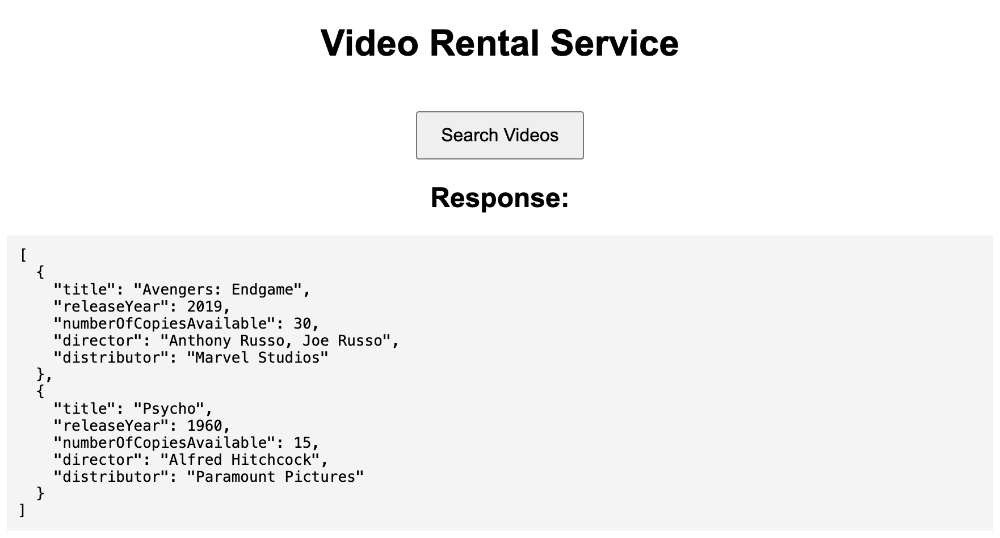

# ZachsVideoRental

This project showcases a video rental service system built with Node.js and Express for the backend and React with TypeScript for the frontend. Users can search for videos available to rent with seamless interactions.



## Features

- **Video Search**: Search for videos available to rent.
- **Pagination and Sorting**: Results are paginated and can be sorted by title or release year.
- **Mock Data**: The backend provides mock data for VHS, DVD, and Projector formats.

## Error Handling

### Search Request Error
If the search request fails, an error message will be displayed on the UI.

## Getting Started

### Prerequisites

- [Docker](https://www.docker.com/products/docker-desktop)

### Backend

1. Navigate to the backend directory:
    ```sh
    cd backend
    ```
2. Install dependencies (if running locally):
    ```sh
    npm install
    ```
3. Compile TypeScript (if running locally):
    ```sh
    npm run build
    ```
4. Run the server (if running locally):
    ```sh
    npm start
    ```

### Frontend

1. Navigate to the frontend directory:
    ```sh
    cd frontend
    ```
2. Install dependencies (if running locally):
    ```sh
    npm install
    ```
3. Serve the app (if running locally):
    ```sh
    npm start
    ```

### Running with Docker

1. Ensure Docker is running on your machine.
2. Navigate to the project root directory and build the Docker containers:
    ```sh
    docker-compose up --build
    ```
3. Open your browser and navigate to `http://localhost` to access the application.

## Usage

- Use the interface to search for videos:
  - **Search**: Click the "Search Videos" button to perform a search.
  - The search results will be displayed below the button.

## License

This project is just kind of done by me so feel free to copy.

### Directory Structure

```
ZachsVideoRental/
├── backend/
│   ├── Dockerfile
│   ├── package.json
│   ├── tsconfig.json
│   ├── src/
│   │   ├── server.ts
│   │   ├── searchService.ts
│   │   └── mockServices.ts
├── frontend/
│   ├── Dockerfile
│   ├── package.json
│   ├── tsconfig.json
│   ├── public/
│   │   ├── index.html
│   ├── src/
│   │   ├── App.tsx
│   │   ├── index.tsx
│   │   ├── index.css
│   │   ├── react-app-env.d.ts
├── docker-compose.yml
├── UI.png
└── README.md
```# full-stack-node-and-NoSQL
